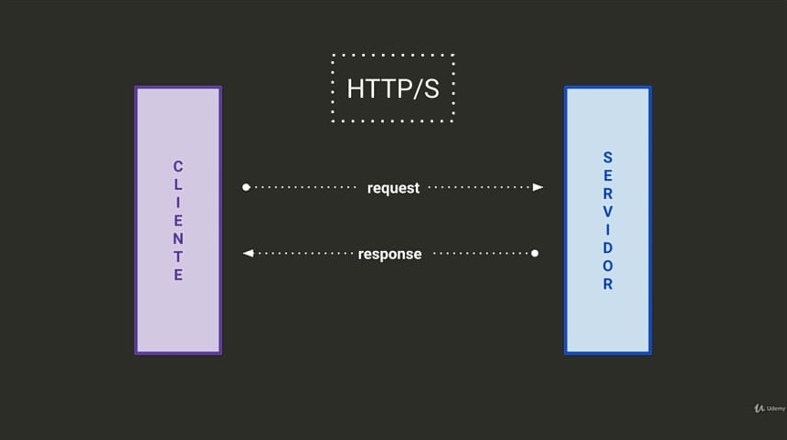

# [COURSE] "La biblia de Node.js".

# Section 05 - Refreshing JS (ES6)

##  Basics - from callback to promises.

### -> Callback
> A function who serves as argument to another function, the second one can call it.

| Advantages                        | Disadvantages                                           |
| --------------------------------- | ------------------------------------------------------- |
| **Simple**, conceptually          | **Toscas**, when nesting many (Callback hell)           |
| **Universal**, they are JS native | **Little intuitive**, to understand the flow is tedious |

#### Notes
*· First callback argument allways will be the error.*

### -> Promise
> **_Object_** which represent the end or fail of a asinconous operation.

| Advantages                                                  | Disadvantages                                               |
| ----------------------------------------------------------- | ----------------------------------------------------------- |
| **Easily chaining**, clair and easy to chain hadling a flow | **No exceptions**, require .catch() method to handel errors |
| **Powerfull**, really capable to handle complex async ops   |

#### Notes
*· use promise instead callbacks. Watch out with promise hell.*

### -> async/await
> An **async** function returns a Promise object. If the function return a value the promise _resolve_ that value and if throws an error or falls on a exception it _reject_ that error or exception.

> The **await** stops an **async** execution until a promise will resolve or reject.                                          |

#### Notes
*· requires a tryCatch block.*

# Section 07 - Sync vs async

## Libuv, Event loop and Non-blocking IO

> Libuv it's a C++ library to manage OS events. It's who 'talks' to the OS.\
> Works togheter with V8.

Libuv has a queue of finished events (Systems events). For each loop Libuv checs that queue, if are something perform a callback to V8.

> Non-blocking IO: Capability to make actions without stop others.

**Note: V8, Libuv and Javascript are all sincronous.\
NodeJS performs actions asynchronous (if we tell to do it)**

# Section 08 - HTTP and web servers.

### -> HTTP
Protocol over which communicate the client and server.

### -> Web server
Software which delivers contents requered by the client. It's distinct to a server (hardware).

### -> NodeJS and web server.
Some details:
- Node can create it's own web server. Includes the tools for it.
- Low fault tolerance. An unhandled error can down a server.
- Frameworks vs vanilla. Both ways can be taken to mount a webserver.

### Client server basic comunication.

The client sends a request to the server, the server process it and return a response. Both, client and server, knows information about each other (like OS, browser, ports and so on) by the request and response.

### HTTP methods 

| METHOD | Standard use                              |
| :----: | ----------------------------------------- |
|  GET   | Read a resource                           |
|  POST  | Create a new resource                     |
|  PUT   | Update an existing resource               |
| PATCH  | Update a property of an existing resource |
| DELETE | Remove an existing resource               |

### Middleware

A middleware it's code that run between the start of therequest and the endpoint of the server.

### MVC
> **M**odel **V**iew **C**ontroller
Code design pattern who sepair the code about responsibilities.

# Section 09 - Databases.

SQL databases starts using at 80s. NoSQL databases are newer.

| SQL                                                                        | NoSQL                                                               |
| -------------------------------------------------------------------------- | ------------------------------------------------------------------- |
| Organize the information on chunks relating between them through unique Id | Extremely usefull when we need to store very changing data          |
| Group the info in "tables"                                                 | Group the info in "collections"                                     |
| Meets ACID props (make the system strong and less vulnerable)              |                                                                     |
| Engines: MSSQL, Oracle, Postgres, MySQL, SQLite, and more                  | Engines: MongoDB, Cassandra, RethinkDB, FirebaseDB, Redis, and more |

### ORM
**O**bject **R**elational **M**apping it's a software model which map db tables on entities for a easily handling.

### ODM
**O**bject **D**ocument **M**apping, same as ORM but document oriented.

### NodeJS - process.argv
It's the process property which store the command line arguments passed to node when the command runs.\
By default argv stores:
<ol start='0'>
 <li>node path.</li>
 <li>file which node runs path.</li>
 <li>and more, the rest of params.</li>
</ol>

---
#NodeJS\
#JavaScript\
#ES6\
#express.js\
#HTTP
